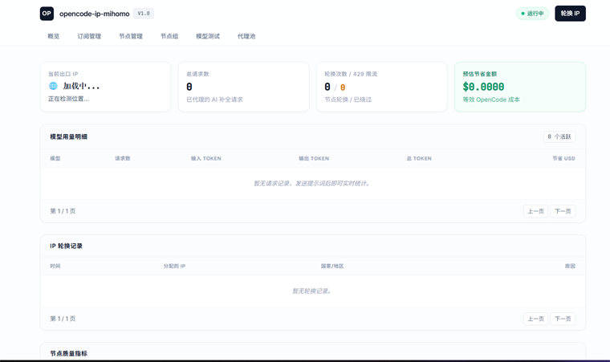
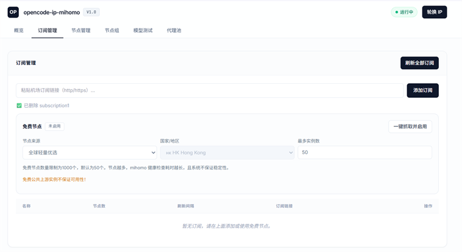
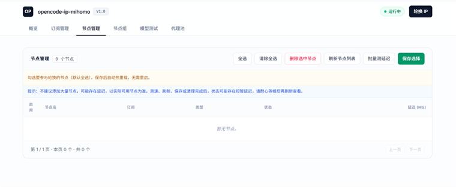
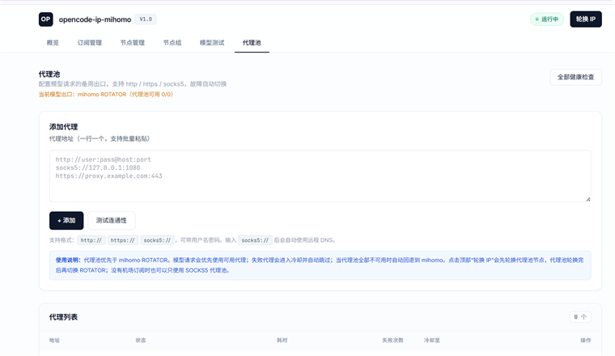

# OpenCode IP Mihomo

[](https://github.com/jiuwangka/opencode-ip-mihomo/releases/tag/v1.0.0) [](https://hub.docker.com/u/jiuwangka) [](LICENSE) [](https://www.python.org/)

一个面向 **OpenCode Zen**、OpenAI 兼容客户端和 Anthropic 客户端的 **mihomo 出口代理网关**。项目将机场订阅节点、可选**提供****免费节点**和 HTTP/HTTPS/SOCKS5 代理池统一纳入管理，并通过 ROTATOR 自动选择可用出口,它旨在防止 HTTP 429 速率限制，保证每个周期使用唯一的 IP 地址。

> 本项目只提供网关、节点管理和出口调度能力，不提供模型账号或代理资源。请自行确认上游服务、订阅和代理的使用权限，免费节点不保证可用性。

## 功能

- OpenAI 兼容：`/v1/chat/completions`、`/v1/responses`
- Anthropic 兼容：`/v1/messages`
- 订阅管理：添加、删除、刷新订阅并同步节点
- 免费节点：地区筛选、按需抓取、测速和清理失效节点
- 节点管理：批量健康检测、延迟统计、节点组和失效节点清理
- 代理池：HTTP/HTTPS/SOCKS5、健康检查、失败冷却和 mihomo 回退
- 自动轮换：优先使用健康代理池，代理池不可用时回退 mihomo ROTATOR
- Web 控制台：订阅、节点、节点组、代理池、模型测试和运行指标
- 速率限制保留 ：返回上游 429 详细信息，而不`Retry-After`尝试绕过模型、帐户、提供商或订阅限制

## 界面预览

<table>
  <tr>
    <td></td>
    <td></td>
  </tr>
  <tr>
    <td></td>
    <td></td>
  </tr>
</table>

## 工作原理

```text
OpenCode / API Client
          │ HTTP :24513
          ▼
proxy-server :8000 ──────► mihomo :7890 ──────► 机场/免费节点
          │                       ▲
          │                       │ Controller :9090
          ▼                       │
     上游模型服务          rotator :8001
                                  │
                                  └── 健康检测、轮换和代理池调度
```

- 宿主机默认端口为 `24513`，网关容器内部端口为 `8000`。
- mihomo 的 `7890`、`9090` 和 rotator 的 `8001` 默认不映射到宿主机。
- 节点测速由 mihomo 针对每个节点独立探测，不使用当前模型请求正在使用的出口。
- 建议只绑定 `127.0.0.1` 或 Docker 网桥地址，再通过 SSH 隧道或内网访问。

## 三种部署方式

### 方案一：Windows

适合普通 Windows 用户。便携 ZIP 已包含网关、rotator 和 mihomo 可执行文件，目标电脑无需安装 Python、Docker 或 Docker Desktop。

1. 从 GitHub Releases 下载 `OpenCode-IP-Mihomo-Windows-Portable-v1.0.0-x64.zip`；
2. 将 ZIP 完整解压到普通目录，不要直接在压缩包内运行；
3. 双击 `start-windows.bat`；
4. 打开 `http://127.0.0.1:24513/dashboard`；
5. 停止时双击 `stop-windows.bat`。

便携版运行数据保存在 `data/`、`mihomo/` 和 `logs/`。这些目录可能包含订阅链接、代理账号或运行状态，请勿上传到公开仓库。

如需自行重新打包，要求仅限构建机器安装 Python：

```powershell
powershell -NoProfile -ExecutionPolicy Bypass `
  -File .\windows\portable\build-portable.ps1 -Version 1.0.0
```

### 方案二：Linux VPS 从源码构建

适合希望在自己的 VPS 上构建镜像的用户。需要 Docker Engine、Compose v2 和 Git。

```bash
git clone https://github.com/jiuwangka/opencode-ip-mihomo.git
cd opencode-ip-mihomo
mkdir -p data mihomo/providers
touch data/proxies.txt
cp mihomo/config.example.yaml mihomo/config.yaml

# 生成控制器密钥，并同时写入 mihomo 配置和 Compose 环境变量
MIHOMO_SECRET="$(openssl rand -hex 32)"
sed -i "s/^secret:.*/secret: \"${MIHOMO_SECRET}\"/" mihomo/config.yaml

cat > .env <<EOF
BIND_IP=127.0.0.1
GATEWAY_PORT=24513
MIHOMO_SECRET=${MIHOMO_SECRET}
EOF

docker compose \
  -f docker-compose.mihomo.yml \
  -f docker-compose.build.yml \
  up -d --build
```

查看状态：

```bash
docker compose -f docker-compose.mihomo.yml -f docker-compose.build.yml ps
docker compose -f docker-compose.mihomo.yml -f docker-compose.build.yml logs --tail=200 -f
```

### 方案三：使用 Docker Hub 镜像部署（推荐）

适合快速部署到 Linux VPS。默认使用：

```text
jiuwangka/opencode-ip-mihomo-proxy:latest
jiuwangka/opencode-ip-mihomo-rotator:latest
metacubex/mihomo:latest
```

无需克隆整个源码仓库，只需下载 Compose 文件和 mihomo 初始配置：

```bash
mkdir -p /root/opencode-ip-mihomo/mihomo/providers
cd /root/opencode-ip-mihomo

curl -fsSL \
  https://raw.githubusercontent.com/jiuwangka/opencode-ip-mihomo/master/docker-compose.mihomo.yml \
  -o docker-compose.mihomo.yml

curl -fsSL \
  https://raw.githubusercontent.com/jiuwangka/opencode-ip-mihomo/master/mihomo/config.example.yaml \
  -o mihomo/config.yaml

cat > .env <<'EOF'
BIND_IP=127.0.0.1
GATEWAY_PORT=24513
MIHOMO_SECRET=
EOF

docker compose -f docker-compose.mihomo.yml pull
docker compose -f docker-compose.mihomo.yml up -d
```

`MIHOMO_SECRET` 必须与 `mihomo/config.yaml` 中的 `secret` 完全一致。默认模板的 `secret` 为空，且控制器端口不映射到宿主机，因此以上配置保持为空即可。

推荐使用 SSH 隧道访问面板：

```bash
ssh -C -L 24513:127.0.0.1:24513 root@YOUR_VPS_IP
```

然后打开：`http://127.0.0.1:24513/dashboard`。

如果 VPS 上其它 Docker 容器需要访问网关，把 `.env` 中的 `BIND_IP` 改为 Docker 网桥网关（常见为 `172.17.0.1`），不要直接开放到公网。

更新版本：

```bash
docker compose -f docker-compose.mihomo.yml pull
docker compose -f docker-compose.mihomo.yml up -d --force-recreate
```

> 如果更新了 `docker-compose.mihomo.yml`，必须把新版 Compose 文件同步到 VPS；不要覆盖 `.env`、`mihomo/config.yaml` 和 `data/`。

## 首次使用

1. 打开控制台的“订阅管理”，添加 Clash 订阅链接；
2. 等待订阅 provider 加载完成；
3. 在“节点管理”中刷新列表并执行批量测速；
4. 根据检测结果保存节点选择或创建节点组；
5. 如需使用代理池，将代理地址写入 `data/proxies.txt`，每行一个；
6. 使用 `/v1/models` 确认模型可用，再把客户端 Base URL 指向网关。
7. 可接入API聚合网关sub2api，key为任意值。

节点数量越多，mihomo 刷新和健康检查耗时越长；系统不保证第三方免费节点的可用性。测速、刷新、保存或清理完成后，状态可能存在短暂延迟，请稍候再刷新查看。

免费节点数量限制为 **1000 个，默认为 50 个**。节点数量过多不保证提取准确，请以实际可用节点为准。

## API 接口

### 模型接口

| 方法     | 路径                     | 说明                                      |
| -------- | ------------------------ | ----------------------------------------- |
| `GET`  | `/v1/models`           | 获取可用模型                              |
| `POST` | `/v1/chat/completions` | OpenAI Chat Completions，支持流式和非流式 |
| `POST` | `/v1/responses`        | OpenAI Responses 兼容接口                 |
| `POST` | `/v1/messages`         | Anthropic Messages 兼容接口，支持 SSE     |

客户端 Base URL 示例：

```text
http://127.0.0.1:24513/v1
```

### 管理接口

| 方法                | 路径                                | 说明               |
| ------------------- | ----------------------------------- | ------------------ |
| `GET`             | `/dashboard`                      | Web 控制台         |
| `GET`             | `/health`                         | 健康状态           |
| `GET`             | `/metrics`                        | JSON 运行指标      |
| `GET`             | `/metrics-prometheus`             | Prometheus 指标    |
| `POST`            | `/api/rotate`                     | 手动轮换出口       |
| `GET/POST/DELETE` | `/api/panel/subscriptions`        | 订阅管理           |
| `POST`            | `/api/panel/refresh`              | 刷新全部订阅       |
| `GET`             | `/api/panel/nodes`                | 获取节点列表       |
| `PUT`             | `/api/panel/nodes`                | 保存节点选择       |
| `POST`            | `/api/panel/test-delay`           | 批量测速           |
| `POST`            | `/api/panel/nodes/cleanup-failed` | 清理失效节点       |
| `GET/POST/DELETE` | `/api/panel/proxies`              | 代理池管理         |
| `POST`            | `/api/panel/proxies/check`        | 代理池健康检查     |
| `GET`             | `/api/panel/free-nodes`           | 免费节点状态       |
| `GET`             | `/api/panel/free-nodes/regions`   | 免费节点地区列表   |
| `POST`            | `/api/panel/free-nodes/fetch`     | 抓取并启用免费节点 |

## 主要配置

复制 `.env.example` 为 `.env` 后按需修改：

| 变量                         | 默认值                                          | 作用                   |
| ---------------------------- | ----------------------------------------------- | ---------------------- |
| `BIND_IP`                  | `127.0.0.1`（示例）                           | 宿主机绑定地址         |
| `GATEWAY_PORT`             | `24513`                                       | 宿主机访问端口         |
| `MIHOMO_SECRET`            | 空                                              | mihomo Controller 密钥 |
| `PROXY_IMAGE`              | `jiuwangka/opencode-ip-mihomo-proxy:latest`   | proxy 镜像             |
| `ROTATOR_IMAGE`            | `jiuwangka/opencode-ip-mihomo-rotator:latest` | rotator 镜像           |
| `MIHOMO_MAX_LATENCY`       | `300`                                         | 节点延迟上限（毫秒）   |
| `WARP_ROTATION_INTERVAL`   | `300`                                         | 自动轮换间隔（秒）     |
| `PANEL_LATENCY_TIMEOUT`    | `15000`                                       | 单节点测速超时（毫秒） |
| `PANEL_LATENCY_WORKERS`    | `8`                                           | 测速并发数             |
| `PANEL_LATENCY_BATCH_SIZE` | `40`                                          | 测速批次大小           |

## 常用运维命令

```bash
# 查看状态
docker compose -f docker-compose.mihomo.yml ps

# 查看全部日志
docker compose -f docker-compose.mihomo.yml logs --tail=200 -f

# 查看 mihomo 日志
docker compose -f docker-compose.mihomo.yml logs --tail=200 -f mihomo

# 重启
docker compose -f docker-compose.mihomo.yml restart

# 停止（保留配置和数据）
docker compose -f docker-compose.mihomo.yml down
```

常见问题：

- **容器名冲突**：执行 `docker ps -a --filter 'name=^/opencode_'`，确认旧容器后再处理；不要删除 `mihomo/` 和 `data/`；
- **节点列表为空**：查看 mihomo 日志，等待 provider 加载完成，再在控制台刷新；
- **端口被占用**：修改 `.env` 中的 `GATEWAY_PORT`，然后重新执行 `up -d`；
- **控制器不可用**：检查 `MIHOMO_SECRET` 是否与 `.env` 一致，并确认 mihomo 容器正在运行。

## 安全说明

- 不要提交 `.env`、真实 `mihomo/config.yaml`、provider 文件、数据库、代理列表和订阅 URL；
- 不要把 `24513`、`7890`、`9090` 或 `8001` 直接暴露到公网；
- 代理池和订阅数据可能含有账号密码，请仅保存在本地运行目录；
- 便携版 EXE 未签名，首次运行可能触发 Windows SmartScreen，请从可信 Release 下载并自行校验哈希。

## 责任免责声明

本项目旨在用于教育、研究和基础设施弹性测试。用户有责任确保其使用符合适用的第三方服务提供商的服务条款和可接受使用政策。维护者对账户暂停、服务中断或滥用行为不承担任何责任。

## 许可证

本项目采用 [MIT License](LICENSE)。
